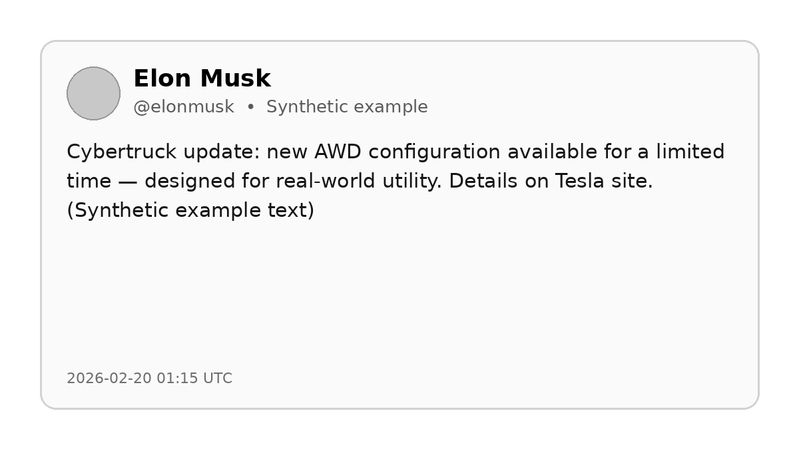
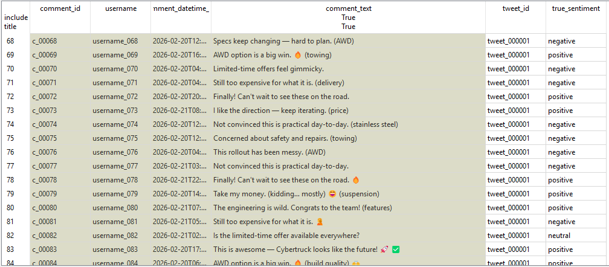
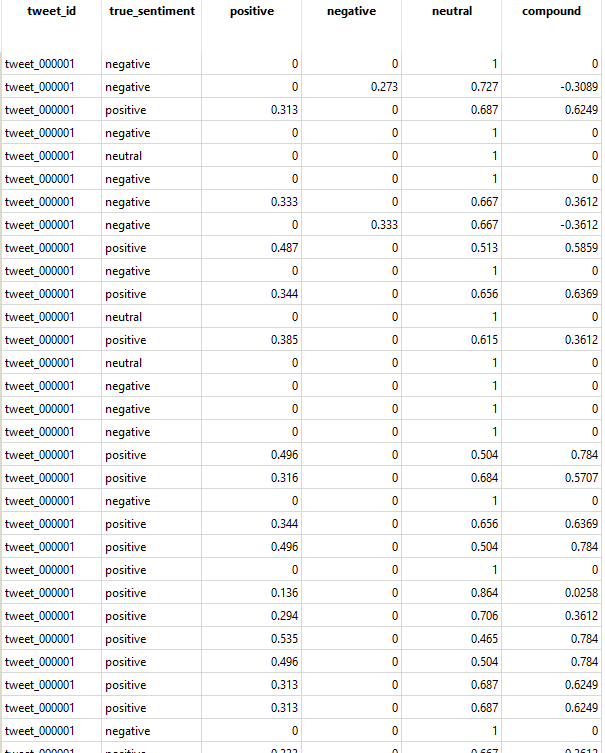
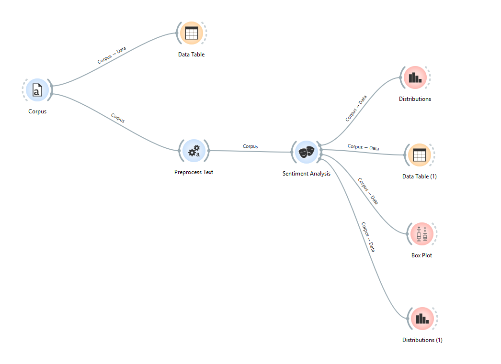
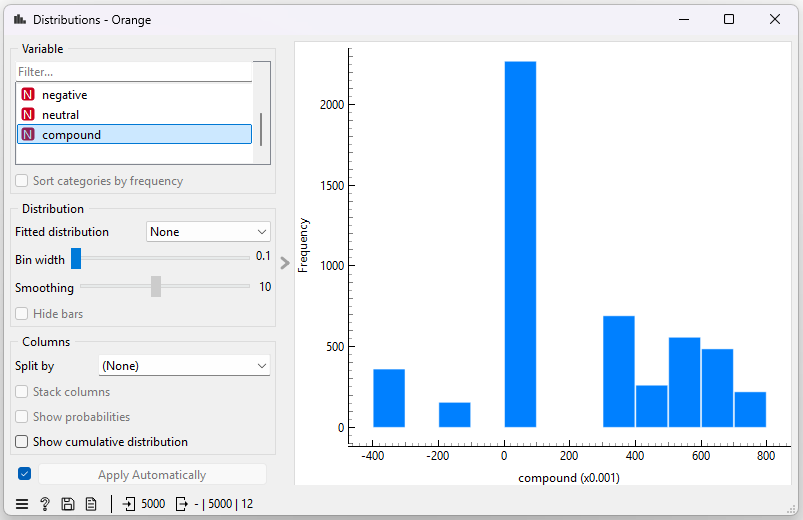
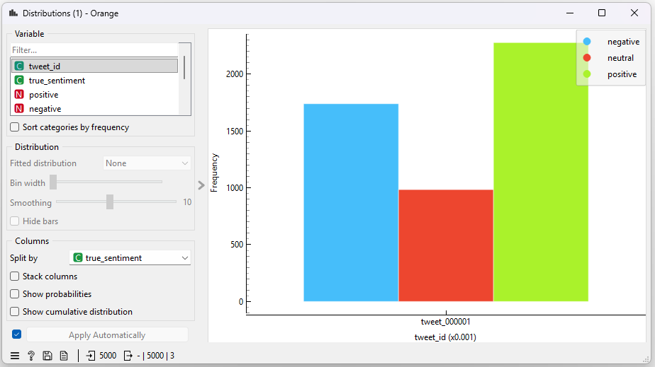
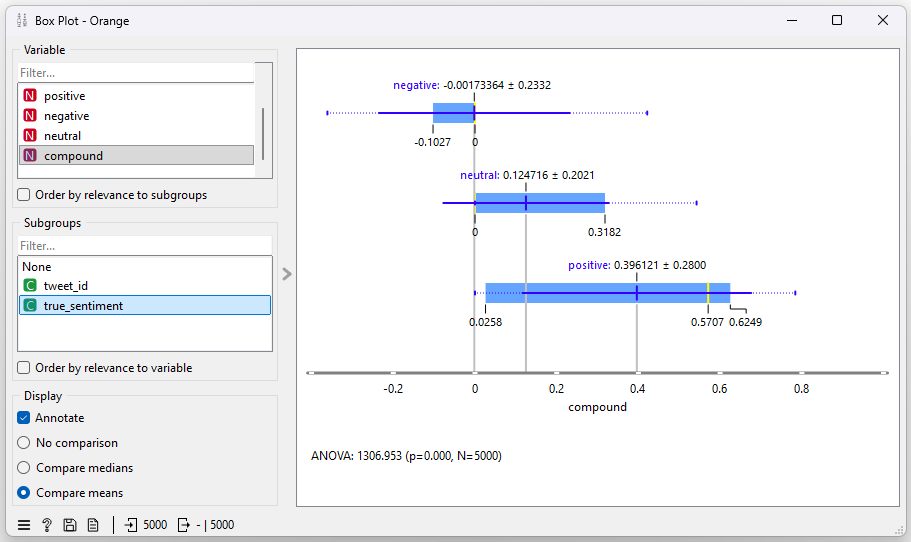

# Sentiment Analysis Using Orange 3 – Twitter Comment Analysis (Synthetic Data)

## Objective

The objective of this exercise is to perform **sentiment analysis** on a large volume of social‑media comments using **Orange 3 (Text Mining add‑on)** and to interpret the overall public response to a high‑profile announcement.

Specifically, we analyse **5,000 synthetic Twitter/X comments** responding to a single tweet announcing a Cybertruck update, in order to:
- understand the distribution of positive, neutral, and negative sentiment,
- explore how sentiment scores behave across a large text corpus, and
- demonstrate an end‑to‑end sentiment analysis workflow in Orange.

This exercise is designed for **learning, experimentation, and demonstration purposes** using synthetic data.

---

## Data Description

### Source and Scope

The dataset consists of:
- **1 synthetic tweet** (metadata only), and
- **5,000 synthetic comments** responding to that tweet.

   
Figure 1: Synthetic Tweet from Elon Musk.

The content is **synthetic and paraphrased**, created to resemble realistic social‑media reactions while avoiding the use of verbatim real‑world text.

### Comment Dataset (`tweet_comments_5000_synthetic.csv`)

Each row represents one comment and contains the following fields:

| Column Name | Description |
|------------|-------------|
| `tweet_id` | Identifier linking the comment to the tweet |
| `comment_id` | Unique identifier for each comment |
| `username` | Synthetic commenter ID (`username_001` … `username_5000`) |
| `comment_datetime_utc` | Date and time of the comment (UTC) |
| `comment_text` | Text of the social‑media comment |
| `true_sentiment` | Known sentiment label used to generate the comment (positive, neutral, negative) |

The `true_sentiment` field is included to allow **validation of sentiment scores** produced by Orange.

   
Figure 2: Sample Data.

---

## Methodology

The analysis was conducted using **Orange 3 with the Orange3‑Text add‑on**, following a structured text‑mining workflow.

### Step 1 – Corpus Creation
- The CSV file containing comment data was loaded into Orange using the **Corpus** widget.
- The `comment_text` column was selected as the text feature.
- Metadata fields (`username`, `comment_datetime_utc`, `comment_id`) were retained as non‑text attributes.

### Step 2 – Text Preprocessing
- The **Preprocess Text** widget was applied to standardise and clean the text.
- Enabled preprocessing steps included:
  - lower‑casing,
  - URL removal,
  - tweet‑specific tokenisation,
  - stop‑word removal,
  - document frequency filtering.

The original text is preserved, while a processed internal representation is created for analysis.

### Step 3 – Sentiment Analysis
- The **Sentiment Analysis** widget was applied using the **VADER** sentiment model.
- For each comment, Orange generated numerical sentiment scores:
  - positive,
  - negative,
  - neutral,
  - compound (overall sentiment score).

 

### Step 4 – Visual Exploration
- **Data Table** was used to inspect sentiment scores at the comment level.
- **Distributions** and **Box Plot** widgets were used to analyse aggregate sentiment behaviour.

---

## Overall Workflow

The complete workflow in Orange is illustrated conceptually as:

   
Figure 3: Overview of the Orange Workflow.

---

## Results

### Sentiment Score Distribution – Compound Score

The compound sentiment score represents the overall polarity of each comment, ranging from strongly negative to strongly positive.

   
Figure 4: Compound Score Distribution.

#### Interpretation
- A large concentration of scores appears around **neutral (near zero)**.
- A substantial positive tail indicates many comments expressing approval or enthusiasm.
- A smaller negative tail reflects critical or sceptical responses.

This pattern is typical for public social‑media discussions, where most comments are informational or mixed, with fewer strongly emotional reactions.

---

### Sentiment Distribution by True Label

To validate model behaviour, sentiment scores were compared against the known `true_sentiment` labels.

   
Figure 5: Sentiment Distribution by True Label.

#### Interpretation
- Comments labelled as **positive** tend to have higher compound scores.
- **Negative** labels cluster toward lower compound values.
- **Neutral** comments are concentrated near zero.

This confirms that the sentiment model behaves consistently with the synthetic ground truth.

---

### Box Plot – Sentiment vs True Sentiment

A Box Plot was used to compare compound scores across sentiment classes.

   
Figure 6: Sentiment Distribution by True Label.

#### Interpretation
- Median compound scores follow the expected ordering:
  - Negative < Neutral < Positive
- Overlap between groups reflects natural ambiguity in language and sentiment expressions.

---

## Interpretation of Results

Overall, the sentiment analysis shows that:
- The majority of comments are **neutral**, indicating a large volume of informational or low‑emotion responses.
- Positive sentiment outweighs negative sentiment, suggesting a generally favourable reaction.
- A visible negative segment highlights critical feedback, which is typical for high‑visibility announcements.

Importantly, the analysis demonstrates that:
- Orange’s text preprocessing and sentiment pipeline is functioning correctly,
- VADER sentiment scores align well with expected sentiment categories,
- Large‑scale text data can be explored efficiently using visual analytics.

---

## Summary

This project demonstrates a complete **sentiment analysis workflow in Orange 3**, applied to a large synthetic social‑media dataset.

Key takeaways:
- Orange 3 provides an accessible, visual approach to text mining and sentiment analysis.
- Preprocessing operates on an internal representation while preserving raw text.
- Sentiment distributions offer meaningful insight into public reaction patterns.
- Including known sentiment labels enables validation and interpretation of results.

This approach is well‑suited for learning, prototyping, and exploratory analysis of unstructured text data.

---

## Disclaimer

All data used in this project is **synthetic** and intended solely for educational and demonstration purposes.
